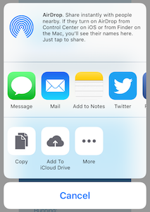
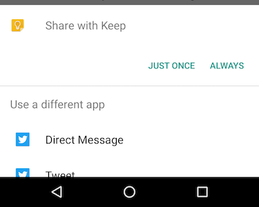

``share``: Native sharing menu for your app.
============================================

The ``forge.share`` namespace allows you to share content from your app via the iOS and Android native share menus.

##API

!method:forge.share.item(content, [targets], success, error)
!param: content `object` an object containing the content to be shared
!param: targets `array`  an optional array of strings defining the built-in activity types to include in the share menu (iOS Only)
!param: success `function()` callback to be invoked when no errors occur
!param: error   `function(content)` called with details of any error which may occur
!platforms: iOS, Android

### `content` parameter

The `content` parameter can contain any combination of the following:

- ``text``: A `string` that will be shared.
- ``subject``: The `string` you would like to use as a subject for the share.
- ``url``: A `string` containint a URL.
- ``image``: A `string` containing a URL that points to the image you'd like to share.

Please note that only certain combinations may be supported depending on the platform and activity targets.

### `targets` parameter

The `targets` parameter is only supported on iOS and allows you to define the subset of built-in activity types that will be displayed as targets in the share menu.

Valid values are:

    "PostToFacebook"
    "PostToTwitter"
    "PostToWeibo"
    "Message"
    "Mail"
    "Print"
    "CopyToPasteboard"
    "AssignToContact"
    "SaveToCameraRoll"
    "AddToReadingList"
    "PostToFlickr"
    "PostToVimeo"
    "PostToTencentWeibo"
    "AirDrop"
    "OpenInIBooks"

Please note that this only applies to the built-in iOS apps. Any 3rd party apps that support sharing will still appear in the share menu.

## Examples:

### Share an image with text and a URL

    forge.share.item({
        image: "https://trigger.io/forge-static/img/trigger-t.png",
        text: "Trigger.IO is the simplest way to build amazing mobile apps",
        url: "https://trigger.io"
    }, function () {
        // success
    }, function (error) {
        // handle any errors
    });

### Share a message and limit the built-in targets to Mail.app

    forge.share.item({
        subject: "Trigger.io",
        text: "Trigger.IO is the simplest way to build amazing mobile apps"
    }, [ "Mail" ], function () {
        // success
    }, function (error) {
        // handle any errors
    });
